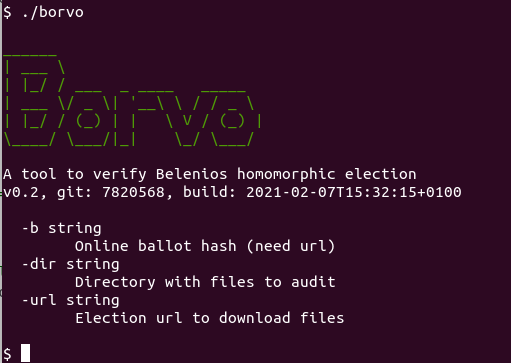

# Borvo

Multi OS tool to verify a Belenios election (homomorphic mode only)

With (maybe easy) readable source code following [Belenios specifications](https://www.belenios.org/specification.pdf)


## Usage



Verify single online ballot

```bash
$ ./borvo -url https://some-vote.server/elections/XXXYYYZZZ -b A25hWwkMU5oE7qfUgywaH0mKZO0TfmE4Q8zZCX8xK0I

```

Verify all results for a closed election

```bash

# create a diretory to store json files
$ mkdir tmp

# download and verify

$ ./borvo -dir tmp -url https://some-vote.server/elections/XXXYYYZZZ


# or verify stored files

$ ./borvo -dir tmp

```


## Build


```bash
$ git clone https://github.com/yvesago/borvo.git
$ cd borvo
$ go test

$ make
```

``make all`` for cross compiling


## Changelog

v0.2:
  * Verify single online balot
  * Add election fingerprint verification


## TODO

* Add verification with proof of decryption


## Licence

MIT License

Copyright (c) 2021 Yves Agostini

<yves+github@yvesago.net>
