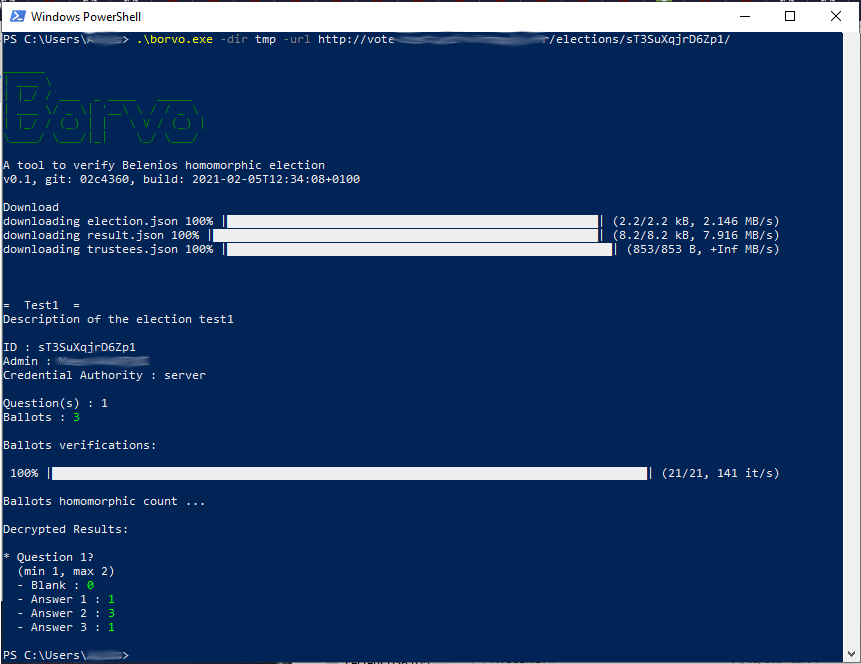

# Borvo

Multi OS tool to verify a Belenios election (homomorphic mode only)

With (maybe easy) readable source code following [Belenios specifications](https://www.belenios.org/specification.pdf)


## Usage


```bash

# create a diretory to store json files
$ mkdir tmp

# download and verify

$ ./borvo -dir tmp -url https://some-vote.server/elections/XXXYYYZZZ


# or verify stored files

$ ./borvo -dir tmp

```




## Build


```bash
$ git clone https://github.com/yvesago/borvo.git
$ cd borvo
$ go test
$ make
```

``make all`` for cross compiling


## TODO

* Add verification with proof of decryption
* Verify single balot


## Licence

MIT License

Copyright (c) 2021 Yves Agostini

<yves+github@yvesago.net>
